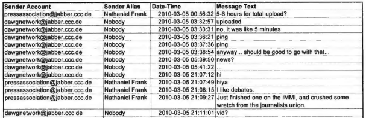
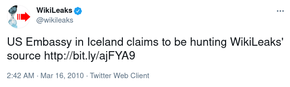
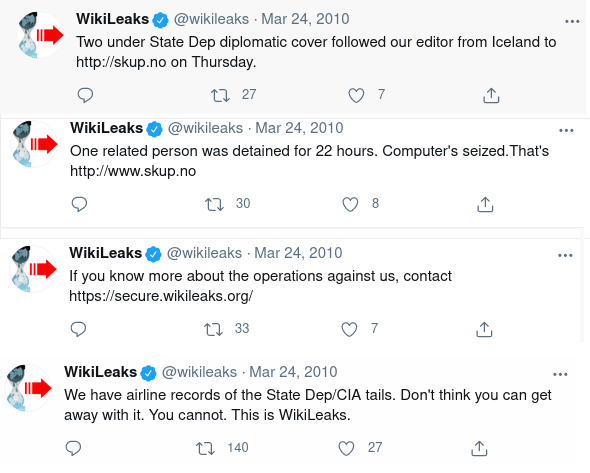
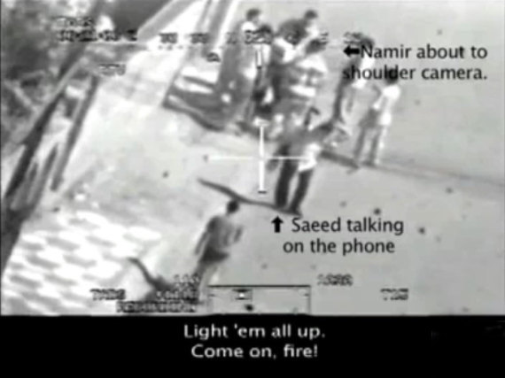
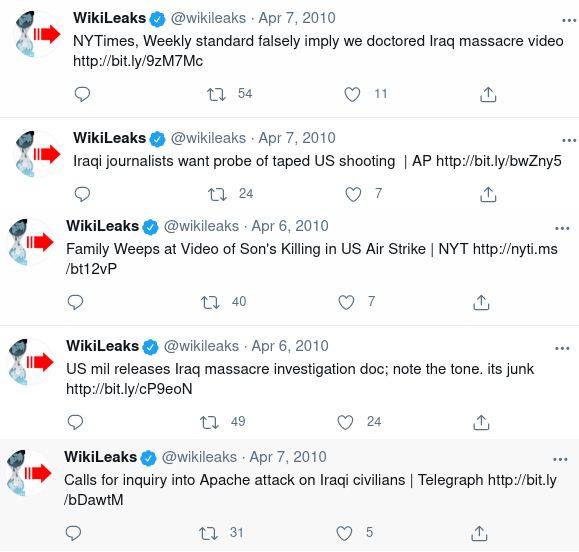
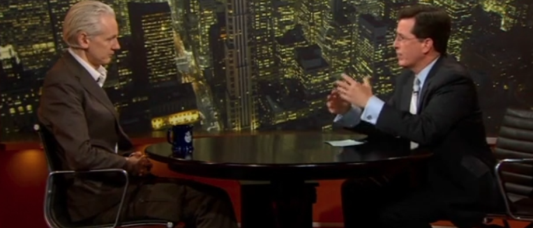
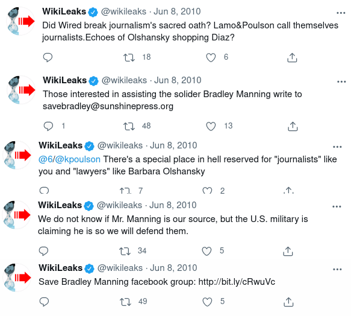
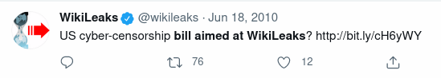

= WikiLeaks: a True History
:figure-caption!:

by Gary Lord

Copyright Gary Lord 2021

== Chapter Five

*AUTHORS NOTE:* 2010 was a huge year for WikiLeaks. This chapter covers only the first half. I am now working on the second half. 

* 

For the first few weeks of 2010, the WikiLeaks website remained down as they concentrated on fundraising and re-vamping their online submission system. A minimum goal of $200,000 was established to keep the organisation running for another year, with a preferred target of $600,000. Some supporters were (again) shocked by WikiLeaks' request for such a large budget, but Julian Assange was anticipating the financial costs of running a global team while maintaining a technical and legal structure that would be strong enough to withstand concerted attacks from major powers. A small-scale operation was never going to survive. 

Here's how the WikiLeaks submission system was described in the link:https://archive.is/guNLC#selection-2335.0-2335.1291[New Yorker] a few months later:

> As it now functions, the Web site is primarily hosted on a Swedish Internet service provider called PRQ.se, which was created to withstand both legal pressure and cyber attacks, and which fiercely preserves the anonymity of its clients. Submissions are routed first through PRQ, then to a WikiLeaks server in Belgium, and then on to “another country that has some beneficial laws,” Assange told me, where they are removed at “end-point machines” and stored elsewhere. These machines are maintained by exceptionally secretive engineers, the high priesthood of WikiLeaks. One of them, who would speak only by encrypted chat, told me that Assange and the other public members of WikiLeaks “do not have access to certain parts of the system as a measure to protect them and us.” The entire pipeline, along with the submissions moving through it, is encrypted, and the traffic is kept anonymous by means of a modified version of the Tor network, which sends Internet traffic through “virtual tunnels” that are extremely private. Moreover, at any given time WikiLeaks computers are feeding hundreds of thousands of fake submissions through these tunnels, obscuring the real documents. Assange told me that there are still vulnerabilities, but “this is vastly more secure than any banking network.”

In January 2010 Julian Assange was still living in Reykjavik, the capital of Iceland, which was still in the middle of a major banking crisis (see Chapter Four: Kaupthing Bank). The country's major banks had collapsed, owing billions to citizens and foreign investors, and the Central Bank was unable to function as a lender of last resort. Whereas governments in the USA and other countries had bailed out banks with public funds, the banks in Iceland were left to collapse. This caused heavy losses for shareholders and wealthy foreign creditors, who asked their own governments to step in and help. Many of these foreigners were Brits and Danes who had €6.7bn deposited in the "Icesave" branch of the collapsed Landsbanki bank. This lead to a diplomatic dispute between Iceland, the Netherlands and Britain.

In July 2009 a link:https://wikileaks.org/wiki/IceSave_settlement_agreement_between_UK_(FSCS)_and_Iceland_(TIF),_6_Jun_2009[copy] of the Icesave agreement between Iceland and the UK had been leaked to the Icelandic press, triggering further protests in both countries. In January 2010, the government of Iceland declared that a second version of their Icesave bill would go to a national referendum on 6 March.

image::2010jaiceland.png[Assange addresses crowd,title="6 March 2010: Julian Assange addresses protestors in Reykjavik"]

During February 2010, WikiLeaks released several more leaked documents about the Icesave scandal. One of them was from Chelsea Manning.

image::2010feb26tweets.png[tweets,align="center"]

* 

On 23 January 2010, Chelsea (then US Army Private Bradley) Manning went back to the USA on leave and ended up stuck in her aunt's house in Maryland due to a blizzard. She was carrying huge backups of confidential data but still hadn't decided what to do with it. The data included massive tables of "Significant Activities" (SIGACTs) logged by military personnel in Iraq and Afghanistan, which Manning routinely analyzed as part of her job. She considered the tables that stored this data "two of the most significant documents of our time."  

> "I began to think about what I knew, and the information I still had in my possession. For me, the SIGACTs represented the on-the-ground reality of both the conflicts in Iraq and Afghanistan. I felt we were risking so much for people that seemed unwilling to co-operate with us, leading to frustration and hatred on both sides. 

> "I began to become depressed at the situation that we found ourselves increasingly mired in, year-after-year. The SIGACTs documented this in great detail, and provided context to what we were seeing on-the-ground... 

> "I believed that if the general public, especially the American public, had access to the information contained within the CIDNE-I and CIDNE-A tables, this could spark a domestic debate on the role of the military and our foreign policy in general, as well as it related to Iraq and Afghanistan. I also believed that a detailed analysis of the data over a long period of time, by different sectors of society, might cause society to re-evaluate the need, or even the desire to engage in CT [counter-terrorist] and COIN [counter-insurgent] operations that ignored the complex dynamics of the people living in the affected environment each day.

Manning decided to leak the data to a US newspaper. She called the Washington Post and spoke with a lady who said she was a reporter. 

> Although we spoke for about five minutes concerning the general nature of what I possessed, I do not believe she took me seriously. She informed me that the Washington Post would possibly be interested, but that such decisions are made only after seeing the information I was referring to, and after consideration by senior editors. 

Manning then decided to contact the New York Times, and phoned the public editor's number listed on their website. 

> The phone rang and was answered by a machine. I went through the menu to the section for news tips and was routed to an answering machine. I left a message stating I had access to information about Iraq and Afghanistan that I believed was very important. However, despite leaving my Skype phone number and personal email address, I never received a reply from the New York Times. 

Manning then considered visiting the offices of the influential political blog Politico, but the weather was still too bad. She concluded that WikiLeaks "seemed to be the best medium for publishing this information to the world within my reach." She joined an online chat and said she had "information that needed to be shared with the world". Someone pointed her to the WikiLeaks online submission page. 

> I considered my options one more time. Ultimately, I felt that the right thing to do was to release the SIGACTs. On 3 February 2010, I visited the WLO website on my computer, and clicked on the "Submit Documents" link.

Manning uploaded the compressed data files along with a text file that she had prepared for the Washington Post. It said the data had already been "sanitized of any source identifying information."

> You might need to sit on this information for 90 to 180 days to best send and distribute such a large amount of data to a large audience and protect the source.

> This is one of the most significant documents of our time removing the fog of war and revealing the true nature of 21st century asymmetric warfare. 

> Have a good day.

* 

On the following day 4 February, @wikileaks coincidentally link:https://twitter.com/wikileaks/status/8613426708?s=20[tweeted] that their minimal funding target of $200,000 had been met: "we’re back fighting for another year, even if we have to eat rice to do it."  

WikiLeaks also posted a link:https://twitter.com/wikileaks/status/8614240243[tweet] about transforming Iceland into a "world centre for investigative media": 

image::2010feb4tweet.png[tweet,align="center"]

Julian Assange was working with Iceland parliamentarians and others on a proposal to turn the island nation into an international "haven" for journalists. On 15 February 2010 he published an article in the Guardian titled link:https://www.theguardian.com/media/organgrinder/2010/feb/15/wikileaks-editor-excited-iceland-journalism[why I'm excited about Iceland's plans for journalism]. 

> In my role as WikiLeaks editor, I've been involved in fighting off more than 100 legal attacks over the past three years. To do that, and keep our sources safe, we have had to spread assets, encrypt everything, and move telecommunications and people around the world to activate protective laws in different national jurisdictions.

> We've become good at it, and never lost a case, or a source, but we can't expect everyone to make such extraordinary efforts. Large newspapers, including the Guardian, are forced to remove or water down investigative stories rather than risk legal costs. Even internet-only publishers writing about corruption find themselves disconnected by their ISPs after legal threats.

Assange urged Iceland to adopt "the strongest press and source protection laws from around the world" so that it could become a "jurisdiction designed to attract organisations into publishing online". He said the banking sector meltdown had convinced Icelanders that fundamental changes were needed.

> Those changes include not just better regulation of banks, but better media oversight of dirty deals between banks and politicians.

The Icelandic Modern Media Initiative (IMMI) proposal was adopted unanimously by parliament in June 1010. But the process of reviewing and updating related laws was repeately delayed by political instability. The Prime Minister of Iceland link:https://en.immi.is/2019/06/28/immi-at-the-cusp-of-implementation/[aimed] to have all the laws finalized and submitted to Parliament before the end of 2019. But by the end of 2020 it seemed the whole project had been indefinitely shelved. 

* 

No doubt bouyed by the huge trove of leaked material from Manning, WikiLeaks in early February link:https://twitter.com/wikileaks/status/8685167915[urged] supporters to keep helping:

image::2010feb6tweet.png[tweet,align="center"]

WikiLeaks' reputation for staring down technological and legal threats continued to grow. On 25 February @wikileaks link:http://bit.ly/b7svqf[boasted] that the Australian government had abandoned its legal case against WikiLeaks for publishing their censorship blacklist. On 13 February they link:https://twitter.com/wikileaks/status/9025406935[boasted] that the Kaupthang bank, which had earlier threatened to"take all applicable and appropriate measures according to law" and had "already obtained US legal council", had been raided by police. 

image::tweet2010feb13.png[tweet,align="center"]

On 15 March WikiLeaks link:https://wikileaks.org/wiki/Over_40_billion_euro_in_28167_claims_made_against_the_Kaupthing_Bank,_23_Jan_2010[released] a full list of Kaupthing Bank claimants, showing over 40 billion euros in 28,167 separate claims.

* 

In distant Iraq, Private Manning was still link:https://docs.google.com/file/d/0B_zC44SBaZPoQmJUYURBUnBycUk/edit[keeping an eye] on the WikiLeaks site: 

> I returned from mid-tour leave on 11 February 2010. Although the information had not yet been published by the WLO, I felt a sense of relief by them having it. I felt I had accomplished something that allowed me to have a clear conscience based upon what I had seen, read about and knew were happening in both Iraq and Afghanistan every day..."

> Shortly after returning from mid-term leave, I returned to the NDC to search for information on Iceland and "Icesave" as the topic had not abated on the WLO channel. To my surprise, on 14 February 2010, I found the cable 10REYKJAVIK13 which referenced the "Icesave" issue directly... I read the cablem [sic] and quickly concluded that Iceland was being bullied, diplocatically [sic], by two larger European powers... I debated on whether this was something I should send to the WLO... I felt I might be able to right a wrong by having them publish this document. I burned the information onto a CD-RW on 15 February 2010, took it to my CHU and saved it onto my personal laptop. 

> I navigated to the WLO website via a TOR connection like before, and uploaded the document via the secure form. Amazingly, the WLO published 10REYKJAVIK13 within hours, proving that the form worked and that they must have received the SIGACT cables."  

* 

Years later, after Chelsea Manning was arrested for leaking this confidential US data, the USA Army posted to its FOIA reading room 13 pages of online chats between Manning, who used the alias "Nobody", and a Wikileaks contact using the alias "Nathaniel Frank", widely assumed (but not proven) to be Julian Assange. The chats cover a period from 5 March to 18 March 2010.
  

On 5 March the WikiLeaks account says they just got "10Gb of banking docs" from a source who had "leaked some before", "had his bank account frozen" and "has been offered 15 million kroner to shut up". Their source "needed to offload them so they'd stop going after him".

On 6 March WikiLeaks says: “full transcript for video is now complete.” This is a reference to the Collateral Murder video, leaked by Manning, which a WikiLeaks team was already working on and would release a month later (see below). Manning helps explain the leaked material and locate the incident. 

On 7 March Manning asks about the value of leaks from the US military's Guantanamo Bay (GTMO) detention center. WikiLeaks repies: “quite valuable to the lawyers of these guys who are trying to get them out” but “politically GTMO is mostly over.” 

At the time many people believed that US President Barack Obama would close down the facility as he had promised to do while campaigning. On the next day, Manning uploads explosive information on the shockingly inhumane treatment of detainees.

    NOBODY: “I’m throwing everything I got on JTC GTMO at you now... summary / history / health conditions / reasons of retaining or transfer of nearly every detainee.”

On the same day, WikiLeaks celebrates the IceSave result in Iceland: 

    NATHANIEL FRANK: "We won the referendum - only 1.4% voted against. How cool is that? First referendum in Icelandic history, ever". 

Manning is less excited, citing California's 2008 "link:https://en.wikipedia.org/wiki/2008_California_Proposition_8[Proposition 8]" ban on same-sex marriage (later overturned) as a reason to be cautious about referendums. 

NOTE:: Another Icesave referendum was held in April 2011, and again nearly 60% of Iceland voters rejected it.

Manning and WikiLeaks discuss world current events with a degree of optimism. 

    NATHANIEL FRANK: "WL actions that were considered radical 3 years ago are now courted... governments/organizations cant control information... the harder they try the more violently the information wants to get out."

After uploading the Guantanamo Bay material on 8 March 2010, Manning says "thats all i really have got left".

    NATHANIEL FRANK: "curious eyes never run dry in my experience"

    NOBODY: “ive already exposed quite a bit, just no-one knows yet... ill slip into darkness for a few years, let the heat die down”

    NATHANIEL FRANK: "Won’t take a few years at the present rate of change.”

Later that day Manning asks if WikiLeaks is "any good at lm hash cracking?" 

    NATHANIEL FRANK:  "we have rainbow tables for lm"

    NOBODY: “80c11049faebf441d524fb3c4cd5351c"

    NOBODY: “i think its lm + lmnt"

    NOBODY: “not even sure if thats the hash... i had to hexdump a SAM file, since i dont have the system file" 

    NATHANIEL FRANK: "what makes you think its lm?... its from a SAM?"

    NOBODY: “yeah"

    NATHANIEL FRANK: "passed it on to our lm guy"

Two days later WikiLeaks followed up: "any more hints on this lm hash? no luck so far". Manning does not appear to have responded. 

NOTE:: From link:https://en.wikipedia.org/wiki/Rainbow_table[Wikipedia]: "A rainbow table is a precomputed table for caching the output of cryptographic hash functions, usually for cracking password hashes." The "SAM" acronym is for Windows Security Accounts Manager (SAM) database, while "lmnt" was presumably a mistype for NTLM, the Microsoft NT LAN Manager.

The US government would later claim the above exchange as proof that Julian Assange had conspired with Manning to hack into the Pentagon’s classified SIPRNet network. But as Assange's lawyers would argue, there's no proof Assange was actually the person chatting with Manning, there's no proof they cracked the password (it seems unlikely: Manning didn't even know if the hash was right) or even that they were specifically trying to hack SIPRNet. In any case, Manning could simply have been engineering an anonymous login to access her existing networks in order to protect her identity. Routine journalistic behaviour includes soliciting classified information from whistle-blowers, providing them with tools to do so, and helping to protect their identities.

Later in the chatlogs, WikiLeaks confirms they have received "the last 4 months of audio from telephones at the .is parliament" from an "intel source" in Iceland. They discuss a bunch of other new leaks, which they see as a positive sign for the future. Manning notes that there has still been no fallout from her leak of the Reykjavik13 cable. 

    NOBODY: “now that humans are getting more and more integrated into this information society... a level of transparency never imagined or even truly desired is coming into play... it makes us more human if anything... we've created states, governments, religious institutions, corporations... all these organizations to hide behind... but at the end of the day we're just guys and girls"

Similarly optimistic, WikiLeaks discusses the idea of making "a reality based, dramatized, thriller movie of one of the wikileaks cases". 

    NOBODY: “this is going to be one hell of a decade"

On 17 March, WikiLeaks proposes sending an encrypted phone to Manning, but they quickly abandon the idea as too dangerous. They agree that if anything happens to Manning, she should send a message with a secret phrase. 

    NATHANIEL FRANK: "you can just tell me "all the ships came in"

* 

At one stage in the above chats, Manning discusses a new WikiLeaks release: 

    NOBODY: “donations coming in good?"

    NATHANIEL FRANK: "not sure... experience in the past is that they don't tend to in response to stories like this... makes people scared to donate"

A day earlier, WikiLeaks had link:https://wikileaks.org/wiki/U.S._Intelligence_planned_to_destroy_WikiLeaks,_18_Mar_2008[released] a secret 32-page "US Department of Defense Counterintelligence Analysis Report", which had been written in March 2008. It discussed the leaking of material by WikiLeaks and how it could best be deterred.

> It must be presumed that Wikileaks.org has or will receive sensitive or classified DoD documents in the future. This information will be published and analysed over time by a variety of personnel and organisations with the goal of influencing US policy.

image::2010marchspray.png[align="center"]

According to a later report in the link:https://www.newyorker.com/magazine/2010/06/07/no-secrets[New Yorker]: 

> Assange regarded the report as a declaration of war, and posted it with the title “U.S. Intelligence Planned to Destroy WikiLeaks.” 

WikiLeaks posted the file with the following editorial summary, noting how the report in many ways justified WikiLeaks' activities: 

> This document is a classified (SECRET/NOFORN) 32 page U.S. counterintelligence investigation into WikiLeaks. "The possibility that current employees or moles within DoD or elsewhere in the U.S. government are providing sensitive or classified information to WikiLeaks.org cannot be ruled out." It concocts a plan to fatally marginalize the organization. Since WikiLeaks uses "trust as a center of gravity by protecting the anonymity and identity of the insiders, leakers or whistleblowers", the report recommends "The identification, exposure, termination of employment, criminal prosecution, legal action against current or former insiders, leakers, or whistleblowers could potentially damage or destroy this center of gravity and deter others considering similar actions from using the WikiLeaks.org Web site". [As two years have passed since the date of the report, with no WikiLeaks source exposed, it appears that this plan was ineffective]. As an odd justification for the plan, the report claims that "Several foreign countries including China, Israel, North Korea, Russia, Vietnam, and Zimbabwe have denounced or blocked access to the WikiLeaks.org website". The report provides further justification by enumerating embarrassing stories broken by WikiLeaks---U.S. equipment expenditure in Iraq, probable U.S. violations of the Chemical Warfare Convention Treaty in Iraq, the battle over the Iraqi town of Fallujah and human rights violations at Guantanamo Bay. 

A report in link:https://gizmodo.com/the-governments-secret-fear-of-wikileaks-where-confide-5494645?utm_source=feedburner&utm_medium=feed&utm_campaign=Feed%3A+gizmodo%2Ffull+%28Gizmodo%29[Gizmodo] noted:

> It's been two years since that memo... and there's no clear evidence that Wikileaks was ever tampered with. But it's chilling to think that it could have ever even - and still may be - a possibility. 

Back on the chatlogs, WikiLeaks wonders if the release of this 2008 document didn't "stir up some internal dissent". 

    NATHANIEL FRANK: "must be some people not too happy about cracking down on whistleblowers and following the chinese"

Manning notes that the "document and its contents is still classified".

*

When Julian Assange finally departed Iceland in late March for an investigative journalism conference in Norway, he link:https://twitter.com/wikileaks/status/10961228323[claimed] he was followed by two US agents. 

Two days later Assange wrote an link:https://grapevine.is/news/2010/03/26/wikileaks-statement-regarding-persecution-and-surveillance-in-iceland/[article] about increasing surveillance of WikiLeaks staff, suggesting it was "related to a film exposing a U.S. massacre we will release at the U.S. National Press Club on April 5". It was unusual for WikiLeaks to give such early notification of a new release, but Assange was being very cautious and strategic. 

> U.S. sources told Icelandic state media’s deputy head of news, that the State Department was aggressively investigating a leak from the U.S. Embassy in Reykjavik. I was seen at a private U.S Embassy party at the Ambassador’s residence, late last year and it is known I had contact with Embassay staff, after.

> On Thursday March 18, 2010, I took the 2.15 PM flight out of Reykjavik to Copenhagen–on the way to speak at the SKUP investigative journalism conference in Norway. After receiving a tip, we obtained airline records for the flght concerned. Two individuals, recorded as brandishing diplomatic credentials checked in for my flight at 12:03 and 12:06 under the name of “US State Department”. The two are not recorded as having any luggage...

> Only a few years ago, Icelandic airspace was used for CIA rendition flights. Why did the CIA think that this was acceptable? In a classified U.S. profile on the former Icelandic Ambassador to the United States, obtained by WikiLeaks, the Ambassador is praised for helping to quell publicity of the CIA’s activities...

> Our plans to release the video on April 5 proceed. We have asked relevant authorities in the Unites States and Iceland to explain. If these countries are to be treated as legitimate states, they need to start obeying the rule of law. Now.

NOTE:: Assange also complained that a young WikiLeaks volunteer in Iceland had been harrassed by police. It was later revealed that he was arrested for trying to break into the factory where his father worked and “the reasons he was trying to get in are not totally justified,” as Assange admitted.

The news of the upcoming Collateral Murder video caused a stir of global media anticipation, making it harder for the US govenment to censor the release. But many people were also surprised to hear that Assange had attended a cocktail party at the US Embassy. How did that happen? 

Assange was still working with a team of Icelandic journalists and political activists. One of them, Birgitta Jónsdóttir, had received an invitation to a cocktail party at the local US embassy. Acccording to Australia's link:https://www.abc.net.au/4corners/sex-lies-and-julian-assange/4156420[Four Corners] team, Jónsdóttir "decided it would be quite funny" to go with Assange, but on the day of the cocktail party she couldn't find him. Jónsdóttir decided not to go; Assange went alone. 

On 29 March 2010, WikiLeaks link:https://wikileaks.org/wiki/U.S._Embassy_profiles_on_Icelandic_PM,_Foreign_Minister,_Ambassador[released] three classified cables that were authored by US diplomat Sam Watson, head of the US Embassy in Iceland, who had been personally chatting with Assange at the cocktail party just a few months earlier. These cables were mildly embarrassing profiles on Iceland's Prime Minister, Foreign Minister, and Ambassador to the USA. 

According to Birgitta Jónsdóttir, "many people thought that he [Assange] had actually gone in and mysteriously sucked out the cables with some spy device or something." 

> Now Sam Watson hadn't leaked and neither had any of the other US Embassy staff. Nonetheless, there was a massive internal investigation.

All eyes were on Iceland ahead of the Collateral Murder release. Nobody was suggesting these leaks could have come from a disgruntled US Army private in Iraq. Assange was protecting his source to the best of his ability. 

*

=== Collateral Murder

On 12 July 2007, two US military Apache helicopters conducted a series of air strikes on a group of civilians in Baghdad, Iraq. At least twelve people were killed, including two Reuters journalists, Saeed Chmagh and Namir Noor-Eldeen. Two children were also badly wounded. The pilots later claimed they that thought their victims were Iraqi insurgents, after mistaking the shadow of a long camera lens held by Noor-Eldeen for a rocket-propelled granade (RPG). Reuters chiefs had spent years seeking access to the full US military video of the attacks without success. The USA insisted their soldiers had acted in accordance with the rules of war and their own official "Rules of Engagement".

On 5 April 2010 WikiLeaks link:https://collateralmurder.wikileaks.org/[released] both the original 38 minute video and a shorter 17 minute version which had been carefully edited to provide context and analysis. Both versions included subtitles based on the helicopters' radio transmissions. WikiLeaks titled their release "Collateral Murder", which outraged those who insisted the attacks did not amount to a war crime. WikiLeaks also released the US military's classified Rules of Engagement for 2006, 2007 and 2008, as evidence that the 2007 incident did not fit these rules "before, during, and after the killings".

Later that month the New Yorker published a lengthy link:https://www.newyorker.com/magazine/2010/06/07/no-secrets[feature] by Raffi Khatchadourian, who had been given extensive access to "the Bunker" - a rented house in Iceland where the WikiLeaks team had worked day and night to prepare this release. He said it took WikiLeaks three months to decode the encrypted video, which Assange called "moderately difficult". To ensure the video stayed online, the team had contacted Google to confirm they would not censor the footage under YouTube's "gratuitious violence" policy. Hoping to catch the US Defense Department unprepared, Assange also "encouraged a rumor that the video was shot in Afghanistan in 2009". And with the help of Iceland’s national broadcasting service, RUV, Assange sent two journalists to Baghdad, to contact the families of the Iraqis who had died in the attack, to prepare them for the media attention, and to gather additional information. 

> Late Saturday night, shortly before all the work had to be finished, the journalists who had gone to Baghdad sent Assange an e-mail: they had found the two children in the van. The children had lived a block from the location of the attack, and were being driven to school by their father that morning. “They remember the bombardment, felt great pain, they said, and lost consciousness,” one of the journalists wrote. The journalists also found the owner of the building that had been attacked by the Hellfires, who said that families had been living in the structure, and that seven residents had died. The owner, a retired English teacher, had lost his wife and daughter. 

Here's how Assange described the video:

> “In this video, you will see a number of people killed. In the first phase, you will see an attack that is based upon a mistake, but certainly a very careless mistake. In the second part, the attack is clearly murder, according to the definition of the average man. And in the third part you will see the killing of innocent civilians in the course of soldiers going after a legitimate target.”

> “This video shows what modern warfare has become, and, I think, after seeing it, whenever people hear about a certain number of casualties that resulted during fighting with close air support, they will understand what is going on. The video also makes clear that civilians are listed as insurgents automatically, unless they are children, and that bystanders who are killed are not even mentioned.”

image::2010collateralsaed.png[align="center"]

US military records stated that everyone killed in the incident, except for the Reuters journalists, was an insurgent. They could not explain how the children were injured. Such innocent victims of war are routinely dismissed as "collateral damage". Assange decided to call the film “Collateral Murder" to help "knock out this ‘collateral damage’ euphemism". 

There was a massive global response to the leak, triggering a prolonged debate about war crimes, the War in Iraq, US empiricism, and the US military's rules of engagement. Exactly what Chelsea Manning had said she wanted. "WikiLeaks" quickly became the world's top search term; a Huffington Post article on Collateral Murder got over ten thousand comments in a day. 

On Twitter, @wikileaks noted that many apologists were focussing debate on whether confusing a camera for an RPG was justified, while ignoring the murderous attack on the van. Others were falsely claiming that WikiLeaks had doctored the video to make the soldiers look bad. Assange repeatedly insisted that permission to kill was given before the word "RPG" was even mentioned. He acknowledged that some people in the Iraqi group were armed, but pointed out that this was not abnormal in a dangerous war zone, and nobody in the group was behaving in a hostile manner.

US Defence Secretary Robert Gates was not a happy man. He link:https://www.reuters.com/article/idUSTRE63C53M20100413[complained] that the video provided a view of warfare "as seen through a soda straw".

> “These people can put out anything they want, and they’re never held accountable for it. There’s no before and there’s no after.” 

Reuters boss David Schlesinger was also not happy. He link:https://www.theguardian.com/commentisfree/cifamerica/2010/apr/21/war-journalists-right-safety[complained] that the US military had only shown Reuters editors the first portion of the video, insisting that their journalists had been in the company of armed insurgents. As a result, Reuters had instructed their journalists to never even walk near armed groups.

> "However, we were not shown the second part of the video, where the helicopter fired on a van trying to evacuate the wounded... We have been trying for more than two and a half years to get this video from the military through formal legal means without success, and in fact have an appeal to their last denial of our request still pending; now it transpires that officials who repeatedly told us that what the video contained was important enough for security reasons to withhold it from us, made no efforts to secure it and weren't even clear where it was. It took a whistleblower to make sure the world had the transparency it needed and deserved." 

WikiLeaks accused the US military of making “numerous false or misleading statements” in the wake of the release and posted additional classified material to counter lies about the attack. WikiLeaks also complained about the lack of follow-up stories in the media in the weeks following the release. One link:https://twitter.com/wikileaks/status/12991995785?s=20[tweet] linked to an extraordinary link:https://www.wsws.org/en/articles/2010/04/emcc-a28.html[interview] with a US soldier, Ethan McCord, who was seen in the video assisting the wounded children. WikiLeaks said it was "just incredible" that it was left to sites like the World Socialist Web Site (WSWS: "the online publication of the world Trotskyist movement") to run such important stories. 

image::2010apr28tweet.png[align="center"]

Ethan McCord and Josh Stieber, both soldiers from Bravo Company 2-16 (the ground team shown in the video), had written a “link:https://web.archive.org/web/20100421033736if_/http://org2.democracyinaction.org/o/5966/p/dia/action/public/index.sjs?action_KEY=2724[Letter of Reconciliation]” to the Iraqi people.

> "We have been speaking to whoever will listen, telling them that what was shown in the Wikileaks video only begins to depict the suffering we have created. From our own experiences, and the experiences of other veterans we have talked to, we know that the acts depicted in this video are everyday occurrences of this war: this is the nature of how U.S.-led wars are carried out in this region."

After rescuing the children, McCord was told to “stop worrying about these motherfucking kids and start worrying about pulling security.” After returning to base, wiping the children's blood from his armour, and complaining about mental health stress, McCord (who had children of his own back home) was ordered to “quit being a pussy” and to “suck it up and be a soldier.” He was threatened with being labeled a “malingerer” which is a crime in the US Army. After again requesting mental health assistance a week later, McCord was told by his superior officers: "get the sand out of your vagina... suck it up and be a soldier" After speaking out in April 2010, McCord received regular link:https://www.worldcantwait.net/index.php/wikileaks/7635-ethan-mccord-receives-death-threats[death theats] from his former fellow soldiers. 

By 2019, the Collateral Murder video had been viewed on Youtube over 16 million times. 

According to Khatchadourian, WikiLeaks received more than two hundred thousand dollars in donations after releasing "Collateral Murder”, prompting Assange to tweet: “New funding model for journalism: try doing it for a change.” That tweet was later deleted, a sign of WikiLeaks' enduring frustration with other media organisations. 

Assange also explained to Khatchadourian his vision for "scientific journalism", insisting on the value of verifiabale source documents like the Collateral Murder video:

> “If you publish a paper on DNA, you are required, by all the good biological journals, to submit the data that has informed your research - the idea being that people will replicate it, check it, verify it. So this is something that needs to be done for journalism as well. There is an immediate power imbalance, in that readers are unable to verify what they are being told, and that leads to abuse.”

* 

Through April 2010 Julian Assange continued doing interviews to promote WikiLeaks and public discussion of their latest leak. 

On 12 April he was in link:https://archive.is/Q6UrR[New York City] for an appearance on link:https://www.cc.com/video/q1yz2t/the-colbert-report-julian-assange[The Colbert Show]. Comedian Stephen Colbert appeared with his face pixellated on TV, then suggested that maybe Assange's face should be the one pixellated instead. But Assange's face had already been shown on screen. 

> "Oh well, he's a dead man."

Cue the laughter. Colbert then challenged Assange about using the provocative title "Collateral Murder", claiming “that’s not leaking that’s pure editorial.” But Assange again insisted that "permission to engage was given before the word RPG was ever used." The link:https://www.politifact.com/factchecks/2010/apr/14/julian-assange/wikileaks-founder-julian-assange-tells-colbert-per/[Politifact] website later rated the claim only "half true" because "while Assange's statement is technically accurate, we think it leaves out critical context".

> "The promise we make to our sources," Assange explained to Colbert, "is that not only will we defend them with every means that we have available, technological, and legally, and politically, but we will try to get the maximum possible political impact for the material they give to us.”

> “If we don’t know what the government is doing, we can’t be sad about it," argued Colbert. "Why are you trying to make me sad?"

> “That's just an interim state, Stephen. You’ll be happier later on.”

A weeks later Assange link:https://www.bbc.com/news/10373176[appeared] as a panelist at a seminar on free speech held in the European Parliament. He said WikiLeaks had tried to contact the US government to open dialogue about the leaks, without any response. WikiLeaks had also engaged lawyers to support their alleged source. 

> "The signals from the US authorities initially were mixed, however, they seem to clarifying now and I think the United States understands that it must obey the rule of law."

Another week later, the 38-year-old WikiLeaks founder link:https://www.youtube.com/watch?v=smMBZvBQXfc[appeared] on Swedish TV, explaining how WikiLeaks differed from other media organisations: 

> "The aim of WikiLeaks is to achieve just reform around the world, and do it through the mechanism of transparency. Now of course many groups have that aim, but our particular view... is to selectively go after material that is concealed. Because organisations that have material, and want to conceal it, are giving off a signal that they believe there will be reform if that material is released. 

He said WikiLeaks also aimed to "facilitate a greater worldwide atmosphere of openness, and protection for the rights of people to publish information". The organisation's long-term goal was to "put the civil into Civilisation" and build up an "historical and intellectual record" of how civilisation in different countries works in practice. "With that information, better decisions can be made" by people regardless of their ideology. 

Assange said WikiLeaks also wanted to "produce an environment where the press is protected, and publishing is protected, and to make that a standard and a norm." 

> "At the moment we are seeing globalisation between the legal regimes of many different countries... There is going to be a harmonisation of laws that apply to information transfer. So that means there is going to be a new standard for freedom of speech. What is it to be? It's up in the air." 

Assange, an admirer of Swedish laws on free speech, suggested the Swedish Constitution could help inform debate on new global standards for information technology. WikiLeaks servers were hosted by a Swedish ISP because of the strong legal protections available in that country. 

Assange said WikiLeaks was now seen as a "publisher of last resort" who could publish things others could not, and that this revealed a "weakness in the global publishing landscape". 

> "There is NOT a truly free press. It has never actually existed. We in the West have deluded ourselves into believing that we actually have a truly free press. We don't. And we can see that in the difference between what WikiLeaks does and what the rest of the press does..." 

> "Through privatisation, we have had many government functions being run by corporations. And now we see the function of censorship has also been privatised. What that means is that litigious billionaires and big companies are able to effectively prevent certain things appearing in public... by using the legal system or patronage networks and economic flows to make it unprofitable to talk about certain things... In the UK at the moment there are three hundred secret gag orders."

In early May 2010 Julian Assange returned home to his native Australia, where polls showed he enjoyed huge public support. His passport was link:https://www.theage.com.au/technology/australian-wikileak-founders-passport-confiscated-20100516-v6dw.html[confiscated] by customs officers at Melbourne Airport, but returned after 15 minutes. He was told the passport was "looking worn" and it would be cancelled soon. An Australian Federal Police officer then searched one of his bags and asked about his hacking conviction from 1991. 

Assange had quickly become a global celebrity. He did a lengthy link:https://archive.is/GNEzr[SBS Dateline] interview - followed by an online Q and A session - with award-winning journalist Mark Davis, who had previously met him in Norway, Sweden and Iceland. For Julian Assange and WikiLeaks, everything was looking positive. 

image::2010may19tweets.png[align="center"]

*

Back in Iraq, however, Chelsea Manning was still struggling with gender identity issues, military life, and anxiety about her recent leaks. She had only two months duty remaining in Iraq before she could return to the USA, where she wanted to get out of the Army and begin transitioning from male to female. Desperate for support from a like-minded soul, she reached out to Adrian Lamo, a bisexual hacker with a history of homelessness and drug abuse. Lamo had been convicted in 2004 after famously hacking The New York Times, Yahoo! and Microsoft. Manning assumed she could trust him, because he had donated to WikiLeaks (see Chapter Four). She was wrong. 

In fact, Lamo was still struggling with his own demons. In April 2010, Lamo's father repeatedly phoned police to warn that Lamo was over-medicating with the drugs he had been proscribed since his 2003 arrest. Lamo later link:https://archive.is/wWEL[insisted] that he was the one who called police, complaining that someone had stolen his medication. In any case, he ended up in the back of an ambulance, and was placed on a 72-hour involuntary psychiatric hold under California state law, just a few weeks before Chelsea Manning reached out to him. He was discharged on 7 May with a diagnosis of Asperger’s Syndrome, a mild form of Autism Spectrum Disorder (ASD).

image::2010lamo.png[Adrian Lamo,title="Adrian Lamo in 2010, image via WIRED"]

Lamo chatted online with Manning for several days from 21 May 2010. He saved their conversations in four files. Then he handed these files over to US government agents. Within a week, Chelsea Manning was arrested. 

The link:https://web.archive.org/web/20131229151650/http://www.wired.com/threatlevel/2011/07/manning-lamo-logs#comments[full chatlogs between Manning and Lamo] were not published until July 2011, but carefully selected portions began appearing in the media from June 2010. 

    MANNING: hi

    MANNING: how are you?

    MANNING: im an army intelligence analyst, deployed to eastern baghdad, pending discharge for “adjustment disorder” [. . .]

    MANNING: im sure you’re pretty busy…

    MANNING: if you had unprecedented access to classified networks 14 hours a day 7 days a week for 8+ months, what would you do?

Lamo asks about Manning's MOS (Military Occupation Specialty). Manning explains she is an Intelligence Analyst who is "in a tricky situation" and "trying to keep a low profile". Lamo promises she can trust him. 

    LAMO: I’m a journalist and a minister. You can pick either, and treat this as a confession or an interview (never to be published) & enjoy a modicum of legal protection.

    MANNING: assange level? 
    
Lamo tries to establish trust by claiming that he "could have flipped for the FBI [but] I held out" and "got a sweeter deal". Manning responds "this is what i do for friends" and sends a link to a Wikipedia page about the recent WikiLeaks releases, basically exposing herself as the world's most famous leaker. Lamo replies five minutes later: "I’ve been a friend to Wikileaks... and donated myself".

    MANNING: i know

    MANNING: actually how i noticed you 

Manning pours her heart out, telling Lamo "i’ve really got nothing to lose [i know, sounds desperate]". She recounts a troubled childhood and says she has now lost all her "emotional support channels" including "family, boyfriend, trusting colleagues... im a mess".
    
    MANNING: i thought i’d reach out to someone who would possibly understand...

    MANNING: <– [this person is kind of fragile]

    MANNING: :’(

Lamo asks if Manning wants to go to the press with her story (presumably it would be his scoop, as he considered himself a journalist). She declines.

    MANNING: hypothetical question: if you had free reign over classified networks for long periods of time... say, 8-9 months... and you saw incredible things, awful things... things that belonged in the public domain, and not on some server stored in a dark room in Washington DC... what would you do?

    MANNING: lets just say *someone* i know intimately well, has been penetrating US classified networks, mining data like the ones described... and been transferring that data from the classified networks over the “air gap” onto a commercial network computer... sorting the data, compressing it, encrypting it, and uploading it to a crazy white haired aussie who can’t seem to stay in one country very long =L

Lamo asks for "the particulars".

    MANNING: crazy white haired dude = Julian Assange

    MANNING: in other words… ive made a huge mess :’

    MANNING: im sorry… im just emotionally fractured

    MANNING: im a total mess

    MANNING: i think im in more potential heat than you ever were

Lamo asks how long Manning has been helping WikiLeaks and what sort of content she has sent them. Manning reveals a lot of details, but also explains how WikiLeaks tries to protect sources.

    MANNING: i mean, im a high profile source... and i’ve developed a relationship with assange... but i dont know much more than what he tells me, which is very little

    MANNING: it took me four months to confirm that the person i was communicating was in fact assange
    
    LAMO: how’d you do that?

    MANNING: I gathered more info when i questioned him whenever he was being tailed in Sweden by State Department officials... i was trying to figure out who was following him... and why... and he was telling me stories of other times he’s been followed... and they matched up with the ones he’s said publicly 

NOTE:: It is possible that more than one person at WikiLeaks was using the "Nathaniel Frank" login. 

Lamo asks if any of the material Manning sent is still unreleased, then discusses WikiLeaks' operational security (opsec). 
    
    MANNING: i’d have to ask assange 

    MANNING: i zerofilled the original

    LAMO: why do you answer to him?

    MANNING: i dont... i just want the material out there... i dont want to be a part of it

    LAMO: i’ve been considering helping wikileaks with opsec

    MANNING: they have decent opsec... im obviously violating it

Lamo keeps probing for more information.

    LAMO: how old are you?

    MANNING: 22

    MANNING: but im not a source for you… im talking to you as someone who needs moral and emotional fucking support

Lamo assures Manning that "none of this is for print... i want to know who i’m supporting". Manning reveals that she had already emailed him, thus revealing her name. 

    LAMO: oh! you’re the PGP guy

    MANNING: im pretty reckless at this point

    MANNING: but im trying not to end up with 5.56mm rounds in my forehead... 
    
    MANNING: that i fired...

NOTE:: Many WikiLeaks critics later blamed Julian Assange for not protecting his source, but it was actually Chelsea Manning whose poor opsec put WikiLeaks at risk. For example, Lamo asks about military-level visibility of the most popular online privacy tools. Manning says OTR (Off The Record) is good because terrorists don't use it, then tells Lamo that Assange "might" use OTR via the Chaos Computer Club's jabber server "but you didnt hear that from me". 

At one point Manning tells Lamo she has been reduced in rank: 

    MANNING: i punched a colleague in the face during an argument… (something I NEVER DO…!?) its whats sparked this whole saga

As a result, Manning's commander got access to all her mental health files and "found out about my cross-dressing history, discomfort with my role in society". 

Manning also reveals a key incident that triggered her decision to go public with the leaks:

    MANNING: i think the thing that got me the most was watching 15 detainees taken by the Iraqi Federal Police for printing “anti-Iraqi literature”... the iraqi federal police wouldn’t cooperate with US forces, so i was instructed to investigate the matter, find out who the “bad guys” were, and how significant this was for the FPs... it turned out, they had printed a scholarly critique against PM Maliki... i had an interpreter read it for me... and when i found out that it was a benign political critique titled “Where did the money go?” and following the corruption trail within the PM’s cabinet... i immediately took that information and *ran* to the officer to explain what was going on... he didn’t want to hear any of it... he told me to shut up and explain how we could assist the FPs in finding *MORE* detainees...

    MANNING: everything started slipping after that... i saw things differently

By this stage, Adrian Lamo is already preparing for Manning's arrest. 

    LAMO: in all seriousness, would you shoot if MP’s showed up? ;>

    MANNING: why would i need to?

    LAMO: suicide by MP. . . .

    MANNING: do i seem unhinged?

    LAMO: i mean, showed up -- for you -- if Julian were to slip up.

    MANNING: he knows very little about me

    MANNING: he takes source protection uber-seriously

    MANNING: "lie to me" he says

    LAMO: Really. Interesting.

    MANNING: he wont work with you if you reveal too much about yourself

Adrian Lamo contacted an old friend, Chet Uber, the founder of a "White Hat" computer security group called Project Vigilant. Uber then link:https://www.forbes.com/sites/firewall/2010/08/01/stealthy-government-contractor-monitors-u-s-internet-providers-says-it-employed-wikileaks-informant/?sh=760cfc9bafd3[contacted] Mark Rasch, a former head of the US Justice Department's computer crime unit and "General Counsel" to that same Project Vigilant group. Four US government agents soon arrived at Lamo's house to scrutinize the logs he had saved. 

Chelsea Manning was arrested in Iraq on 27 May 2010 and sent to "pre-trial confinement" in Kuwait, where she link:https://www.theguardian.com/commentisfree/2015/may/27/anniversary-chelsea-manning-arrest-war-diaries["essentially lived in a cage"] inside a hot tent for over a year. Guards told her she woud be sent to the Guantánamo Bay prison or some other secret interrogation site.

> At the very lowest point, I contemplated castrating myself, and even – in what seemed a pointless and tragicomic exercise, given the physical impossibility of having nothing stable to hang from – contemplated suicide with a tattered blanket, which I tried to choke myself with. After getting caught, I was placed on suicide watch in Kuwait.

Manning was not transferred to the USA, where she suffered further torture at the Marines' Quantico Brig in Virginia, for over a year. 

* 

News of Chelsea Manning's arrest was first link:https://archive.is/gsvu5[reported] by WIRED magazine on 6 June 2010, ten days after her actual arrest. 

> Manning was turned in late last month by a former computer hacker with whom he spoke online. In the course of their chats, Manning took credit for leaking a headline-making video of a helicopter attack that Wikileaks posted online in April. The video showed a deadly 2007 U.S. helicopter air strike in Baghdad that claimed the lives of several innocent civilians.

> He said he also leaked three other items to Wikileaks: a separate video showing the notorious 2009 Garani air strike in Afghanistan that Wikileaks has previously acknowledged is in its possession; a classified Army document evaluating Wikileaks as a security threat, which the site posted in March; and a previously unreported breach consisting of 260,000 classified U.S. diplomatic cables that Manning described as exposing “almost criminal political back dealings.”

> “Hillary Clinton [then US Secretary Of State], and several thousand diplomats around the world are going to have a heart attack when they wake up one morning, and find an entire repository of classified foreign policy is available, in searchable format, to the public,” Manning wrote.

Adrian Lamo was not named as the source of the WIRED exclusive, even though he had an existing relationship with WIRED editor Kevin Poulsen, who had also previously been link:https://unsolved.com/gallery/kevin-poulsen/[convicted of hacking] as a teenager (in 1994, after pleading guilty to mail, wire and computer fraud, money laundering, and obstruction of justice, Poulsen was sentenced to 51 months in prison with $56,000 fines). Interestingly, the guy who sent the agents to Lamo's house, Mark Rasch, had also been involved in the investigation of Poulsen, leading many observers to later speculate that both Lamo and Poulsen had been "flipped". 

On the next day 7 June 2010, the BBC published an link:https://www.bbc.com/news/10255887[interview] with Lamo: 

> "A lot of people have labelled me a snitch. I guess I deserve that on this one but not as a generality. This was a very hard decision for me."

Citing his previous arrest for hacking, Lamo said he "felt the need to contact investigators" because Manning's approach was "basically a suicide pact."

> "I was worried for my family - that if I were obstructing justice that they could be caught up in any investigation. I wanted to do this one by the book, by the numbers. I didn't want any more FBI agents knocking at the door."

> "I want to be proud of it but I can't bring myself to be. I keep thinking about what it was like being 22, alone and not knowing about my future. Knowing that I did that to somebody - it hurts. I feel like I should be talking to a priest."

> "I hope that Manning gets the same chance as I did - the same chance to take his punishment as I did and start a new life as I did. I like to think I prevented him from getting into more serious trouble." 

In following weeks, however, Lamo's interviews were increasingly full of contradictions and even blatant lies. The carefully selected portions of the Manning-Lamo chatlogs that were released by US media outlets had a clear bias against Manning and Assange. 

WikiLeaks pushed back hard against the arrest: 

It is quite likely that WikiLeaks did not know for sure if Manning was the source of their leaks, because they had worked hard to keep her identity a secret, even from themselves. Meanwhile, Manning's disclosure to Lamo of further leaks in the WikiLeaks pipeline was causing serious panic in Washington. 

On 10 June a former New York Times reporter link:https://archive.is/I88DB#selection-1737.0-1755.72[wrote] that ”Pentagon investigators” were trying “to determine the whereabouts of the Australian-born founder of the secretive website Wikileaks for fear that he may be about to publish a huge cache of classified State Department cables that, if made public, could do serious damage to national security.” Salon.com journalist Glenn Greewald noted that there was a “Pentagon manhunt” underway for Assange - "as though he’s some sort of dangerous fugitive".

By the end of 2010, progressive media sites had link:https://shadowproof.com/merged-manning-lamo-chat-logs/[documented] numerous problems with comments from Lamo, WIRED editors, and the published sections of the chatlogs. In late December 2010 Glenn Greenwald link:https://www.salon.com/2010/12/27/wired_5/[demanded to know] why Poulsen was still hiding the full chatlogs and allowing media speculation to run wild.

> Poulsen's concealment of the chat logs is actively blinding journalists and others who have been attempting to learn what Manning did and did not do. By allowing the world to see only the fraction of the Manning-Lamo chats that he chose to release, Poulsen has created a situation in which his long-time "source," Adrian Lamo, is the only source of information for what Manning supposedly said beyond those published exceprts.  Journalists thus routinely print Lamo's assertions about Manning's statements even though - as a result of Poulsen's concealment - they are unable to verify whether Lamo is telling the truth.

> To see how odious Poulsen's concealment of this evidence is, consider this link:http://www.nytimes.com/2010/12/16/world/16wiki.html[December 15 New York Times article by Charlie Savage], which reports that the DOJ is trying to prosecute WikiLeaks based on the theory that Julian Assange "encouraged or even helped" Manning extract the classified information.  Savage extensively quotes Lamo claiming that Manning told him all sorts of things about WikiLeaks and Assange that are not found in the portions of the chat logs published by Wired:

By the time WIRED finally published the full Lamo-Manning chatlogs in July 2011, a false media narrative had been firmly established whereby Julian Assange had somehow helped Manning "hack" into US government networks and "steal" confidential material, thus "putting lives at risk". The actual chatlogs proved the opposite: WikiLeaks took great pains to protect their source, verify the material, and publish it responsibly. WIRED editor Evin Hansen link:https://www.huffpost.com/entry/bradley-manning-traitor-hero_b_898789[claimed] that they had "held material back out of respect for Manning’s privacy". This was hard to believe, given that most of the withheld sections had nothing at all to do with Manning's personal life. 

As Glenn Greenwald concluded:

> The concern was that Wired was concealing material to glorify and shield its source, Poulsen's long-time associate Adrian Lamo, in a way that distorted the truth and, independently, denied the public important context for what happened here. Wired's release of the full chat logs leaves no doubt that those concerns were justified, and that Wired was less than honest about what it was concealing. 

NOTE:: Adrian Lamo was link:https://www.kansas.com/news/local/crime/article210989594.html[found dead] in his Wichita appartment on 14 March 2018, apparently due to either suicide or chronic drug over-use, at the age of 37. 

* 

News of Chelsea Manning's arrest followed the April 2010 indictment of NSA whistle-blower link:https://en.wikipedia.org/wiki/Thomas_A._Drake[Thomas Drake] and the May 2010 sentencing of an FBI translator, Shamai K. Leibowitz, who received 20 months in prison for providing classified documents to a blogger. It triggered an link:https://www.nytimes.com/2010/06/12/us/politics/12leak.html[article] in the New York Times on 15 June 2010: 

> "In 17 months in office, President Obama has already outdone every previous president in pursuing leak prosecutions.

The article quoted Steven Aftergood, head of a project on government secrecy at the Federation of American Scientists, saying that both major US parties now felt leaks had gotten out of hand and needed to be deterred. 

> “I think this administration, like every other administration, is driven to distraction by leaking. And Congress wants a few scalps, too. On a bipartisan basis, they want these prosecutions to proceed.” 

The Justice Department had just renewed a subpoena in a case involving The New York Times reporter James Risen, whose 2006 book “State of War” described a bungled US attempt to disrupt Iran’s nuclear program. Seven months later, former CIA officer Jeffrey Sterling would be indicted for unauthorized disclosure of national defense information to Risen. 

The Obama administration was repeatedly turning to the Espionage Act of 1917 to pursue such leaks, drawing strong criticism for their select interpretation of antiquated World War One laws in a new world of online communications. But what was the alternative?  

On 18 June 2010 @wikileaks link:https://twitter.com/wikileaks/status/16468709105?s=20[tweeted] that a new US cyber-censorship bill appeared to be "aimed at WikiLeaks". The tweet linked to a Daily Beast link:https://web.archive.org/web/20100811183601/http://www.thedailybeast.com/blogs-and-stories/2010-06-18/new-bill-would-let-obama-police-internet-for-national-security-reasons/?cid=hp:exc[story] titled "Can Obama Shut Down the Internet?"

> A new bill rocketing through Congress would give the president sweeping powers to police the Web for national-security reasons. Could this be a way to block WikiLeaks? 

> The bill would grant President Obama the power to declare a “national cyber-emergency” at his discretion and force private companies tied to the Web, including Internet service providers and search engines, to take action in response—moves that could include limiting or even cutting off their connections to the World Wide Web for up to 30 days.

Critics said the bill would give the US President a "Kill Switch" for the Internet, and pointed out that this sort of behaviour was regularly condemned by the USA when regimes like China did it. As if to prove the point, on 28 June 2010 the Thai government blocked access to wikileaks.org. And in Britain, the National Union of Journalists was link:https://www.ispreview.co.uk/story/2010/06/25/journalists-unite-to-stop-uk-digital-economy-act-and-isps-blocking-legitimate-sites.html[challenging] the new Digital Economy Act, which could be used against websites that publish material of public interest without permission (e.g. WikiLeaks).

After widespread criticism, the proposed US government link:https://en.wikipedia.org/wiki/Protecting_Cyberspace_as_a_National_Asset_Act[Protecting Cyberspace as a National Asset Act] of 2010 was never voted into existence. But over the next ten years a whole raft of new laws like this would be introduced around the world, severely limiting civil rights and online freedoms in the name of "national security". 

This was the urgent debate about a "new standard for freedom of speech" that Julian Assange - and before him the Cypherpunks - had long been warning about. Which way would the world swing: towards "a growing, expanding crypto anarchy" (to repeat Tim May's words from 1996) or an increasingly dystopian authoritarianism? 

image::timmay.jpeg[A tribute to Tim May by Eloisa Cadenas,title="Timothy C. May, 1951-2018 : a tribute by Eloisa Cadenas"]

* 

*AUTHORS NOTE:* 2010 was a huge year for WikiLeaks. This chapter covers only the first half. I am now working on the second half. Meanwhile, here's a brief timeline of major events in the second half of 2010. 

*25 July 2010:* WikiLeaks began publishing the link:https://wikileaks.org/wiki/Afghan_War_Diary,_2004-2010[Afghan War Diary] in conjunction with other global news organisations. A Guardian editorial link:https://web.archive.org/web/20110728043710/http://www.guardian.co.uk/commentisfree/2010/jul/25/afghanistan-war-logs-guardian-editorial?intcmp=239[stated]: "The war logs consist of more than 92,000 records of actions of the US military in Afghanistan between January 2004 and December 2009." 

*11 August 2010:* Julian Assange landed in Sweden to negotiate a deal for WikiLeaks Internet storage servers. He stayed at the apartment of a woman named Anna Ardin, who had consensual sex with him over several days. Four days later Assange gave a speech at Stockholm's Trade Union Headquarters, where another woman, Sofia Wilen, was in the audience wearing a pink cashmere sweater. She also later had consensual sex with him. Both women then discussed their experiences and went to the police on 20 August 2010, link:https://defend.wikileaks.org/about-julian/#swedish[reportedly] because they wanted Assange to have an AIDS test. The chief prosecutor for Stockholm reviewed the police allegations and dropped the preliminary investigation, stating that “no crime at all” had been committed and that “the evidence did not disclose any evidence of rape”. She link:https://www.bbc.com/news/world-europe-11151277[dismissed] the arrest warrant against Mr Assange, who had remained in Sweden while the case was resolved. 

*1 September 2010:* Sweden's Director of Prosecution, Marianne Ny, reopened the investigation a week later and placed herself in charge of it, but did not request Assange's detention.  

*27 September 2010:* Julian Assange's suitcase went missing during a direct flight from Stockholm to Berlin. Assange later stated in an link:https://wikileaks.org/IMG/html/Affidavit_of_Julian_Assange.html[affadavit]: "The suitcase carried three laptops containing WikiLeaks material, associated data and privileged communications protected under client-attorney confidentiality laws and source protection laws. The suspected seizure or theft occurred at a time of intense attempts by the US to stop WikiLeaks' publications of 2010."

*22 October 2010:* Iraq War Logs link:https://archive.nytimes.com/www.nytimes.com/2010/10/23/world/middleeast/23casualties.html[published] by WikiLeaks and global media partners. Now archived at the same link:https://wardiaries.wikileaks.org/[War Diaries] site as the Afghan War Diary files. 

*25 October 2010:* Julian Assange link:https://www.craigmurray.org.uk/archives/2010/08/julian_assange/comment-page-1/[won] the Sam Adams Award for Integrity, awarded by former CIA security professionals. 

*18 November 2010:* The BBC link:https://www.bbc.com/news/world-europe-11785281[reported]: "Sweden is to issue an international arrest warrant for WikiLeaks founder Julian Assange in a rape case."

*20 November 2010:* Sweden link:https://www.bbc.com/news/world-europe-11803703[issued a warrant] for the arrest of Julian Assange. 

*28 November 2010:* The first of 251,287 Cablegate files were published by WikiLeaks and global media partners. The files are now available link:https://wikileaks.org/plusd/?qproject[online] as part of the PlusD library. 

*2 December 2010:* Australian Prime Minister Julia Gillard link:https://www.smh.com.au/technology/wikileaks-acting-illegally-says-gillard-20101202-18hb9.html[declared] that the leaking of classified documents via the WikiLeaks website was "illegal". She ordered a full police investigation into Julian Assange and WikiLeaks. 

*4 December 2010:* Julian Assange published answers to readers' questions in a link:https://www.theguardian.com/world/blog/2010/dec/03/julian-assange-wikileaks[Guardian Q and A].

*7 December 2010:* Julian Assange surrendered to UK police and was placed in solitary confinement at Wandsworth Prison in London. He was released ten days later after supporters paid a massive £340,000 bail.

*8 December 2010:* The Australian newspaper link:https://web.archive.org/web/20101207195607/http://www.theaustralian.com.au/in-depth/wikileaks/dont-shoot-messenger-for-revealing-uncomfortable-truths/story-fn775xjq-1225967241332[published] an article by Julian Assange titled "Don't Shoot The Messenger For Revealing Uncomfortable Truths".  

> "The powers of the Australian government appear to be fully at the disposal of the US as to whether to cancel my Australian passport, or to spy on or harass WikiLeaks supporters. The Australian Attorney-General is doing everything he can to help a US investigation clearly directed at framing Australian citizens and shipping them to the US."

*10 December 2010:* Australian police link:https://www.smh.com.au/technology/julian-assange-has-committed-no-crime-in-australia-afp-20101217-190eb.html[declared] that neither WikiLeaks nor its founder Julian Assange has committed any crime. 

*14 December 2010:* The United States Department of Justice issued a subpoena directing Twitter to provide information for accounts registered to or associated with WikiLeaks. Twitter link:https://web.archive.org/web/20110725200602/http://www.guardian.co.uk/media/2011/jan/08/us-twitter-hand-icelandic-wikileaks-messages[notified] affected users. 

*20 December 2010:* US Vice President Joe Biden link:https://www.theguardian.com/media/2010/dec/19/assange-high-tech-terrorist-biden[said] of WikiLeaks journalism: "I would argue it is closer to being a hi-tech terrorist than the Pentagon papers." Many other prominent figures in the USA and allied states had already called for Julian Assange's arrest or link:https://www.youtube.com/watch?v=ZuQW0US2sJw[assassination]. 

*

link:ch6.html[NEXT CHAPTER: 2011] 

*

The author of this book has been an active supporter of WikiLeaks since at least 2010. He can be found at: 

Twitter: https://twitter.com/jaraparilla

Blog: https://jaraparilla.blogspot.com

Patreon: https://patreon.com/jaraparilla
 
Any $$$ support welcome on Paypal: https://paypal.me/jaraparilla or here: https://www.gofundme.com/f/wikileaks-true-history-book

Thank you.

*

Select a chapter: link:index.html[Home] - link:ch1.html[Genesis] - link:ch2.html[2007] - link:ch3.html[2008] - link:ch4.html[2009] - link:ch5.html[2010] - link:ch6.html[2011] 

Copyright Gary Lord 2021

